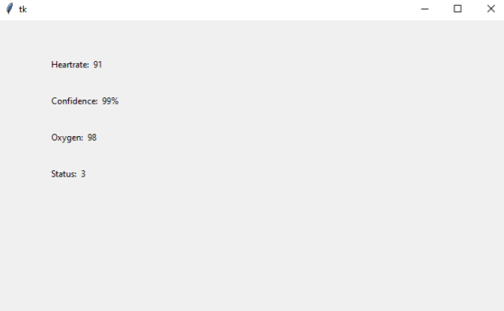

# Sensor Data Collection

This repository is for testing sensor data collection from the SparkFun Pulse Oximeter and Heart Rate Sensor.

## Python GUI Application

The basic gui is made using `tkinter` a python GUI application. In the future, a more robust application framework will be used if the sensor data is collected in this manner.

Below is a screenshot of the basic custom GUI application with data connected to the Arduino over serial.

With 99% confidence, the platform appears to be roughly equivalent to the data seen on an apple watch. The accuracy of the Oxygen level is unknown at this time.

## Arduino Code

The arduino code is based off of the [example sketch](https://github.com/sparkfun/SparkFun_Bio_Sensor_Hub_Library/blob/master/examples/Example1_config_BPM_Mode1/Example1_config_BPM_Mode1.ino) from SparkFun with modifications to allow real-time transmission of data over serial.

### Dependencies

In order to run, the Arduino code requires the following dependencies:
- [SparkFun Bio Sensor Hub Library](https://github.com/sparkfun/SparkFun_Bio_Sensor_Hub_Library)
- Arduino IDE (1.8.16 was verified)

## Custom serial protocol

### Begin Message
`DATA_BEGIN` - begins sensor data collection

### End Message
`DATA_END` - finishes collection of a data sample

### Data
`<Variable>: <Value>`

List of possible variables described over serial:
- Heartrate - the user heartrate in BPM
- Confidence - the confidence of the accuracy of the values given in percent
- Oxygen - the blood oxygen level of the user
- Status - the status value from 0-3

*Note that the values are defined as strings, and must be evaluated to a different format.*
